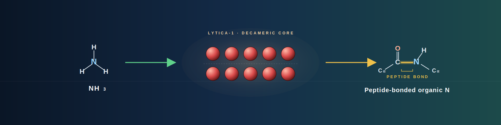

<small><small><small>Metabolic NH<sub>3</sub> → decameric Lytica-1 catalyst (Q43127) → peptide-bonded organic N.</small></small></small>

# Project Lytica


An industrial framework for **nitrogen upcycling efficiency in closed-loop
lunar habitats**. Project Lytica specifies a catalytic agent (**Lytica-1**),
an efficiency metric (**L**, the Lytica), and an interoperability protocol
(the **Lytica Link**) that together govern the conversion of metabolic
NH₃ waste into stable amino-acid inputs for habitat bio-manufacturing.

---

## Linked Contents

- [Overview](#overview)
- [Setup](#setup)
- [Quick Start](#quick-start)
- [Usage](#usage)
- [Dataset](#dataset)
- [References](#references)
- [Author](#author)

## Overview

### Core concepts

- **Lytica-1** — the engineered catalytic agent, templated on the
  decameric GSII architecture of *Arabidopsis thaliana* GS2 (UniProt
  Q43127).
- **L (Lyticas)** — the unit of catalytic flux efficiency.
  `1 L ≡ native Q43127 catalytic flux`. A catalyst rated at *n* L
  processes *n* times the nitrogen throughput per gram of enzyme.
- **The Lytica Link** — the governing protocol (designation **LL-N1**)
  for the NH₃ → amino-acid chemical interface between recovery and
  bio-manufacturing modules. Certification tiers: Bronze (≥ 1 L),
  Silver (≥ 2 L), Gold (≥ 5 L), **Diamond (≥ 10 L)**.

### Repository layout

- `bio_eng/` — engineering specifications and reference-material data.
  Includes the Q43127 FASTA template (`gs2_template.fasta`), the
  `LyticaStandard` class (`lytica_1_specs.py`), and the Lytica-1
  thermostabilization mutation panel (`lytica_1_mutations.md`).
- `sys_model/` — mathematical models. `flux_simulator.py` computes
  payload-mass reduction as a function of L and reports the ATP-coupled
  Sustained Power draw required to maintain a given N recycling rate.
- `standards/` — the Lytica Link technical white paper
  (`lytica_protocol_v1.md`) and related interoperability documents.
- `docs/` — supporting documentation: compliance & certification
  protocol (including the Link Certificate JSON Schema), the
  cross-section schematic of the reaction chamber, and the executive
  summary.
- `lytica/` — local Python virtual environment (not tracked).

## Setup

Python 3.11 or newer is required. Clone the repository, create a venv
named `lytica` at the repo root, and install the pinned dependencies:

```bash
python3 -m venv lytica
source lytica/bin/activate
pip install -r requirements.txt
```

Dependencies (`requirements.txt`): `numpy`, `pandas`, `biopython`.

To (re-)populate the FASTA template of the Q43127 reference material,
run the bundled fetch script once after setup (requires network access
to ExPASy):

```bash
python3 bio_eng/fetch_gs2.py
```

## Quick Start

```bash
# Inspect the reference material spec:
python3 bio_eng/lytica_1_specs.py

# Run the flux / uplift-mass / power simulator:
python3 sys_model/flux_simulator.py
```

**Key documents at a glance:**

| Artifact | Path | Purpose |
| --- | --- | --- |
| White paper (LL-N1 v1) | `standards/lytica_protocol_v1.md` | Scope, terminology, system-impact argument, technical benchmarks. |
| **Compliance & certification** | `docs/compliance_testing.md` | Certification tiers, stress-test protocol, **Lytica Link Certificate JSON Schema** (§3.1), Link Port specs incl. high-radiation shielding. |
| **Mutation map** | `bio_eng/lytica_1_mutations.md` | 8-candidate thermostabilization panel on Q43127, all positions verified against the actual sequence. |
| Reaction-chamber schematic | `docs/link_port_schematic.svg` | Cross-section of the shielded LL-N1 chamber (Pb + HDPE + decameric core). |
| Executive summary | `docs/executive_summary.md` | One-pager business case for NASA/commercial partners. |
| Flux simulator | `sys_model/flux_simulator.py` | Payload-mass reduction vs. L, ATP-coupled power draw, mission-integrated energy. |
| FASTA template | `bio_eng/gs2_template.fasta` | Q43127 (430 aa precursor), fetched via `bio_eng/fetch_gs2.py`. |

## Usage

### Reference-material spec

`bio_eng/lytica_1_specs.py` defines the `LyticaStandard` dataclass and a
`DEFAULT_STANDARD` instance keyed to the Q43127 template:

```python
from bio_eng.lytica_1_specs import DEFAULT_STANDARD, TM_TARGET_K

s = DEFAULT_STANDARD
print(s.oligomeric_state)          # "decamer"
print(s.tm_baseline_k, TM_TARGET_K)  # 310.15 K, 341.17 K (+10% in Kelvin)
print(s.meets_thermal_target())    # False until thermal_stability >= 1.10
seq = s.load_template_sequence()   # reads bio_eng/gs2_template.fasta
```

### Flux / mass / power simulator

`sys_model/flux_simulator.py` models uplift mass and ATP-coupled power as
functions of an efficiency rating `L` and a mission profile:

```python
from sys_model.flux_simulator import MissionProfile, sweep, power_requirement_w

mission = MissionProfile(duration_days=730, fixed_mass_kg=500.0,
                         nitrogen_kg_per_day=1.2, name="Lunar 2yr/6crew")
df = sweep(mission, [1, 2, 5, 10])
print(df)                                   # mass, savings, power
print(power_requirement_w(mission.nitrogen_kg_per_day))  # ~121 W
```

At L = 5 the illustrative scenario shows ~51 % uplift reduction vs. the
native baseline; power draw is L-independent because the GS reaction is
strictly 1 ATP per NH₃ (see the module docstring for the rationale).

### Lytica Link Certificate (LL-N1 JSON Schema)

Every certified catalyst ships with a machine-readable certificate. The
authoritative JSON Schema is in `docs/compliance_testing.md` §3.1
(required fields: `certified_L`, `Tm_observed`,
`sequence_identity_to_Q43127`, plus tier / manufacturer / stress-test).
A worked example appears in §3.3 of the same file.

## Dataset

**Q43127 — *Arabidopsis thaliana* glutamine synthetase 2**
(chloroplastic/mitochondrial; 430 aa precursor; mature chain 50–430
after cleavage of a 49-aa chloroplast transit peptide).

- **Source:** UniProt Knowledgebase, accession **Q43127**
  (SwissProt identifier `GLNA2_ARATH`).
- **Retrieval:** `bio_eng/fetch_gs2.py` downloads the SwissProt record
  via `Bio.ExPASy.get_sprot_raw` and writes it as FASTA to
  `bio_eng/gs2_template.fasta`.
- **Role in the project:** structural and sequence template for the
  Lytica-1 catalyst; the L metric is defined relative to this enzyme's
  native catalytic flux; the mutation panel in
  `bio_eng/lytica_1_mutations.md` references Q43127 precursor (1-based)
  numbering throughout, with every candidate position verified against
  the saved FASTA.

## References

- **UniProt Q43127** — *Arabidopsis thaliana* glutamine synthetase,
  chloroplastic/mitochondrial (gene *GLN2*, identifier `GLNA2_ARATH`).
  Primary sequence record; see `bio_eng/gs2_template.fasta`.
  <https://www.uniprot.org/uniprotkb/Q43127>
- **Ishiyama K. et al. (2004)** — characterization of Arabidopsis
  glutamine synthetase isoforms. PubMed ID **15273293**; referenced in
  the EC-annotation evidence block of the Q43127 UniProt record. Used
  here as the source for the native-GS2 kcat placeholder in
  `sys_model/flux_simulator.py` (`NATIVE_GS2_KCAT_S`).
- **PDB 2D3A** — crystal structure of maize cytosolic glutamine
  synthetase GS1a (Unno et al.). Recommended homology-model target for
  validating the subunit–subunit interface assignments in the Lytica-1
  mutation panel; see `bio_eng/lytica_1_mutations.md` caveats section.
- **OLTARIS** (NASA Langley on-line radiation-transport tool) — the
  reference radiation-transport modelling framework for confirming the
  shielding stack in `docs/compliance_testing.md` §4.1.1 against any
  specific mission GCR/SPE spectrum.

## Author

Project Lytica technical office.

- Maintainer contact: *fill in name* — `cc15000@gmail.com`
- Contributions: open a pull request against the relevant artifact
  (mutation panel, simulator, or standards documents). Changes to the
  LL-N1 v1 standard require a formal amendment and revision bump.

---

## Status

Scaffolding, reference-material spec, flux simulator, LL-N1 white paper,
compliance/certification protocol, reaction-chamber schematic, candidate
mutation panel, and executive summary are all in place. Open items
before the numeric benchmarks can be treated as load-bearing:

- Lab calibration of the native-GS2 kcat (simulator `NATIVE_GS2_KCAT_S`).
- Lab calibration of ATP-regeneration efficiency
  (simulator `ATP_REGEN_EFFICIENCY`).
- Homology model of Q43127 against PDB 2D3A (maize GS1a) to unblock the
  engineered-disulfide candidate in `bio_eng/lytica_1_mutations.md`.
- Radiation-transport modelling (OLTARIS or equivalent) against the
  specific mission GCR/SPE spectrum to confirm the §4.1.1 shielding
  stack in `docs/compliance_testing.md`.
